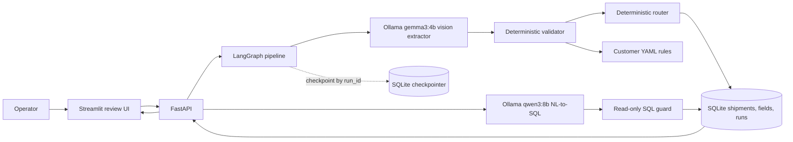

The production dashboard should show documents/day, decision mix, uncertainty by field, human overrides of auto-approvals, failure type, per-agent p50/p95 latency, and tokens/cost per document. The graph records separate extractor, validator, router, and end-to-end timings; Ollama reports token counts on successful extraction runs. Earlier cloud-provider failures remain in history. Local inference cost is not estimated. The production dashboard is proposed, not implemented.
Cloud cost per document is not applicable to local Ollama inference, though local hardware/energy costs are not measured. Cost/latency still rise with page count, image resolution, or the extractor's grounding retry; current controls include a three-page cap and one extraction retry maximum.
# Nova Trade-Document Pipeline: Technical Write-Up

## 1. Architecture and State

The graph passes typed extraction, validation, and decision objects between stages. LangGraph checkpoints each completed stage using the run ID as its thread ID; application output and evidence are written separately to SQLite. The API returns these persisted results to the Streamlit interface.

## 2. Failure Cases and Controls

The examples below are recorded in [failures.md](failures.md). They include a live SQL-generation failure and a deterministic grounding regression fixture; they are not historical customer incidents.

- **Semantic SQL literal mismatch:** a live Gemini query used `decision = 'auto-approved'` instead of the database enum `auto_approve`, producing zero rows when one shipment was approved. The prompt now includes the exact enum values; a retest returned one row.
- **Guessed field alias and wrong value column:** a live query used `fields.field = 'consignee'` and selected `value`; the result was empty. The prompt now enumerates exact field keys and distinguishes `found` from raw `value`; a retest returned `ACME Trading Co.` for `consignee_name`.
- **Ungrounded extracted value:** an offline regression fixture returns a value with a quote absent from the document text. The extractor retries once, then replaces the unsupported value with null and confidence zero. This verifies the control but is not a live Gemini failure.

## 3. Observability at 50 Customers

Carry the shipment/run ID through upload, graph nodes, database rows, UI retrieval, and query answers. A production dashboard should show documents/day, decision mix, uncertainty by field, human overrides of auto-approvals, failure type, per-agent p50/p95 latency, and tokens/cost per document. Current sample runs record total pipeline latency and model only; token and dollar-cost columns remain null. Current production-story metrics are proposed, not implemented.

## 4. Cost

Cost per document is not available from this run: Groq usage metadata and model pricing have not been priced. No cost estimate is substituted. Cost can rise with page count, image resolution, or the extractor's grounding retry; production controls should include page/DPI caps, one retry maximum, and a configured per-document cost ceiling.

## 5. Latency

The local Gemma API runs recorded 7,682.31ms for `clean_invoice.pdf` and 6,463.06ms for `messy_scanned_invoice.pdf`; median total pipeline latency is 7.07s across these two synthetic runs. Extractor usage was 488 input/461 output tokens for clean and 489/461 for messy. These are local prototype measurements, not a service-level commitment.

## 6. If I Had a Week

I would prioritize representative, customer-approved evaluation data and image-only OCR before UI polish. Next I would add per-agent token/cost/latency telemetry, establish a cost cap, and run a supervised pilot that records operator overrides. That sequence reduces the risk of optimizing a synthetic benchmark that does not reflect customer documents.
